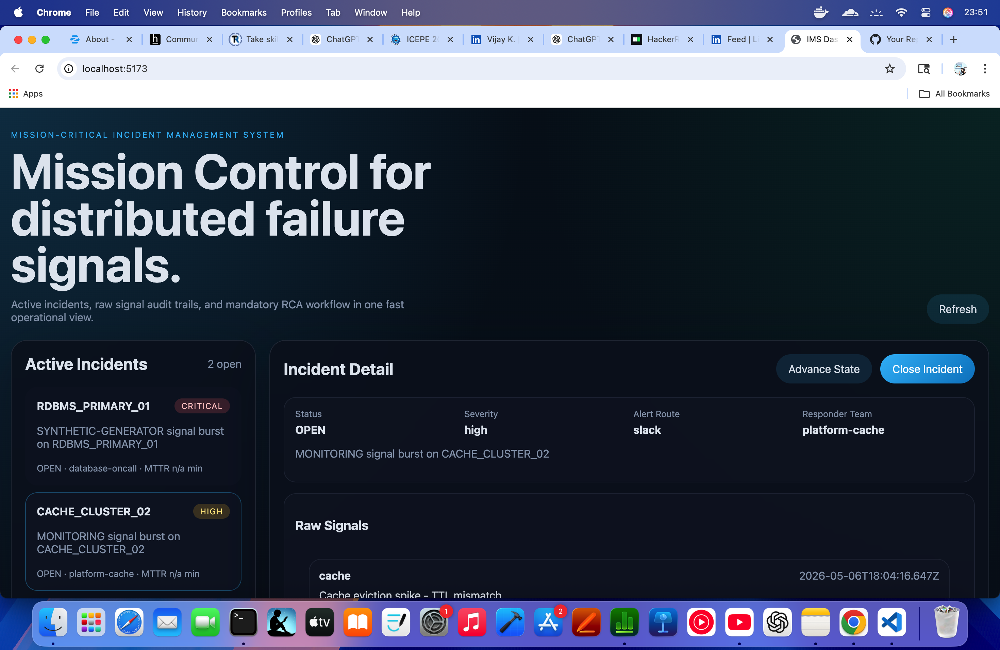
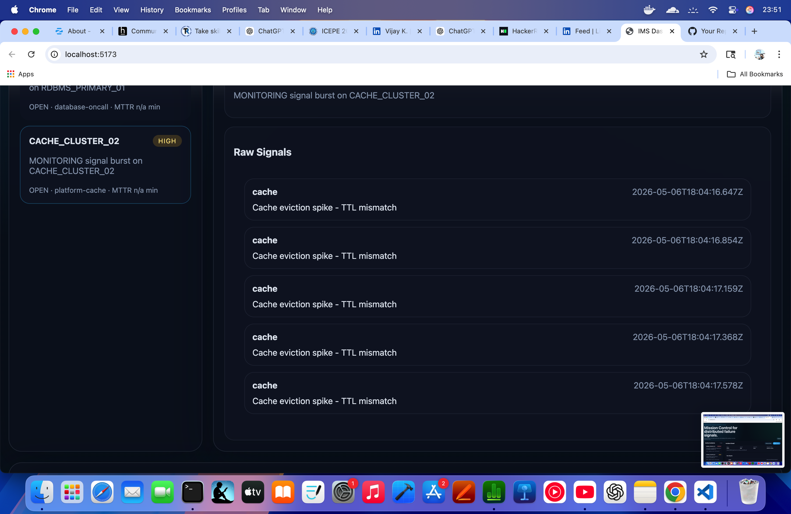
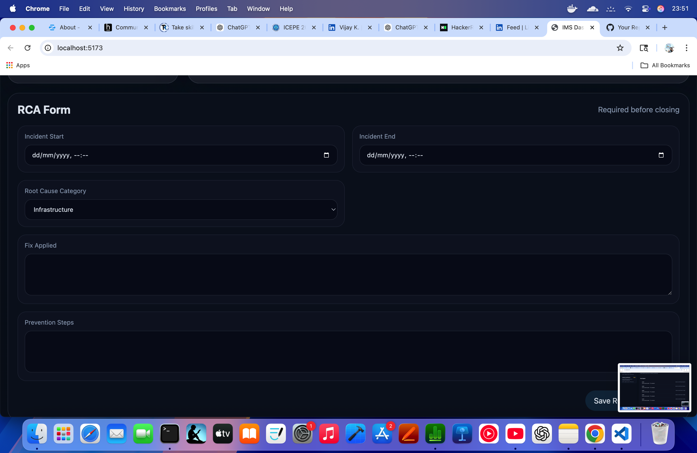
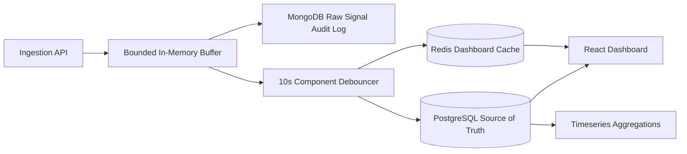

## Screenshots

### Live Project



### Live Project 2



### Live Project 3




# Incident Management System

Resilient incident management platform for high-volume failure signals across APIs, MCP hosts, caches, async queues, PostgreSQL, and NoSQL services.

## Architecture



## Stack

- Backend: Node.js, Fastify, PostgreSQL, MongoDB, Redis
- Frontend: React + Vite
- Async workflow: bounded in-memory buffer plus debounce coordinator
- State management: workflow state pattern and alert strategy pattern

## Setup

1. Start the infrastructure and apps:

```bash
docker compose up --build
```

2. Open the frontend at `http://localhost:5173`.
3. Health check the backend at `http://localhost:3001/health`.

## Local Development

Install dependencies once:

```bash
npm install
```

Run the backend and frontend in separate terminals:

```bash
npm run dev:backend
npm run dev:frontend
```

## Sample Failure Data

The repository includes [`scripts/failure-event.json`](scripts/failure-event.json) and can be extended with a generator script for synthetic incidents.

## Backpressure

Backpressure is handled by a bounded in-memory ingestion buffer, rate limiting on the ingestion API, and asynchronous persistence. When the buffer is full, the API sheds load with a `503` response instead of blocking or crashing. Raw signal storage and work-item creation are decoupled so slow persistence does not stall request handling.

## Submission Notes

- Repository is split into `/backend` and `/frontend`.
- Prompts/spec/plan notes are checked in under `docs/` and `.github/`.
- RCA is mandatory before closing a work item.
